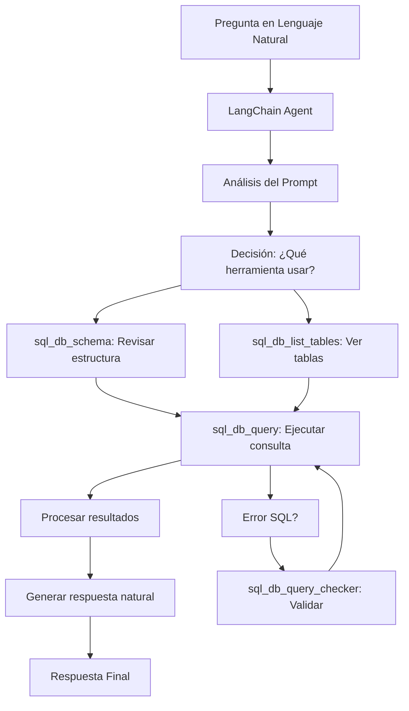

# 🧠 LangChain SQL Agent - Análisis Técnico Completo

## 📋 Índice
1. [¿Qué es LangChain y cómo funciona?](#qué-es-langchain-y-cómo-funciona)
2. [Arquitectura de Nuestro Sistema](#arquitectura-de-nuestro-sistema)
3. [Análisis del Prompt Engineering](#análisis-del-prompt-engineering)
4. [Problemas Actuales y Limitaciones](#problemas-actuales-y-limitaciones)
5. [Mejoras Futuras Recomendadas](#mejoras-futuras-recomendadas)
6. [Evaluación de Rendimiento](#evaluación-de-rendimiento)

---

## 🔍 ¿Qué es LangChain y cómo funciona?

### Concepto Fundamental
**LangChain** es un framework diseñado para crear aplicaciones que utilizan modelos de lenguaje de gran escala (LLMs). Su fortaleza principal es la capacidad de **conectar LLMs con fuentes de datos externas** y **herramientas específicas**.

### Componentes Clave en Nuestro Sistema

#### 1. **LLM (Large Language Model)**
```python
llm = ChatOpenAI(
    model="gpt-3.5-turbo",
    temperature=0,  # Sin aleatoriedad para respuestas consistentes
    openai_api_key=OPENAI_API_KEY,
    request_timeout=30
)
```
- **Modelo:** GPT-3.5-turbo (balance entre costo y capacidad)
- **Temperature:** 0 (máxima predictibilidad)
- **Función:** Interpreta lenguaje natural y genera SQL

#### 2. **SQL Database Connection**
```python
db = SQLDatabase.from_uri(SUPABASE_URI, sample_rows_in_table_info=0)
```
- **Conexión:** Directa a Supabase PostgreSQL
- **Introspección:** Analiza automáticamente el esquema de la BD
- **Limitación:** `sample_rows_in_table_info=0` evita muestreo (performance)

#### 3. **SQL Toolkit**
```python
toolkit = SQLDatabaseToolkit(db=db, llm=llm)
```
**Herramientas disponibles:**
- `sql_db_query`: Ejecuta consultas SELECT
- `sql_db_schema`: Obtiene información del esquema
- `sql_db_list_tables`: Lista tablas disponibles
- `sql_db_query_checker`: Valida sintaxis SQL

#### 4. **SQL Agent**
```python
agent = create_sql_agent(
    llm=llm,
    toolkit=toolkit,
    verbose=False,
    prompt=custom_prompt,
    handle_parsing_errors=True
)
```

### Flujo de Funcionamiento



---

## 🏗️ Arquitectura de Nuestro Sistema

### Stack Tecnológico
```
├── Frontend (React/Next.js)
│   ├── Chat Interface
│   ├── Map Integration
│   └── API Calls
│
├── API (FastAPI + LangChain)
│   ├── Agent Initialization
│   ├── Prompt Template
│   ├── Context Management
│   └── Error Handling
│
├── Database (Supabase PostgreSQL)
│   ├── Spatial Data (Cities, Districts, Neighborhoods)
│   ├── Indicators (Demographics, Urban Data)
│   ├── Point Features (Schools, Hospitals)
│   └── Views (Optimized Queries)
│
└── LLM (OpenAI GPT-3.5-turbo)
    ├── Natural Language Understanding
    ├── SQL Generation
    └── Response Synthesis
```

### Flujo de Datos
1. **Input:** Usuario hace pregunta en React
2. **Processing:** FastAPI envía a LangChain Agent
3. **Analysis:** Agent analiza prompt y contexto
4. **Query:** Genera y ejecuta SQL en Supabase
5. **Synthesis:** Convierte resultados a lenguaje natural
6. **Output:** Respuesta formateada al usuario

---

## 📝 Análisis del Prompt Engineering

### Estructura del Prompt Actual

#### 1. **Definición de Rol**
```
You are a helpful and knowledgeable AI agent specialized in analyzing 
and answering questions about urban and demographic data in Spanish cities.
```
**✅ Fortalezas:**
- Define claramente el dominio (datos urbanos)
- Establece el tono (helpful, knowledgeable)

**❌ Debilidades:**
- Muy genérico para "Spanish cities" pero solo tenemos Barcelona
- No especifica nivel de expertise esperado

#### 2. **Estructura de Base de Datos**
```
Database Structure:
- Spatial data is organized in three levels:
  - Level 1: `cities` (geo_level_id = 1)
  - Level 2: `districts` (geo_level_id = 2) 
  - Level 3: `neighbourhoods` (geo_level_id = 3)
```
**✅ Fortalezas:**
- Información clara y estructurada
- Mapeo directo de conceptos geográficos

**❌ Debilidades:**
- No incluye ejemplos de IDs específicos
- Falta información sobre relaciones entre tablas

#### 3. **Instrucciones Específicas**
```
Important:
- Always return the name of the city, district or neighbourhood — never just the geo_id.
- Use the `geographical_unit_view` to map geo_id and geo_level_id to the corresponding name.
- For Barcelona data, filter by city_id or use city_id in your joins.
```
**✅ Fortalezas:**
- Instrucciones muy específicas para evitar errores comunes
- Prioriza usabilidad (nombres vs IDs)

**❌ Debilidades:**
- Hardcoded para Barcelona (no escalable)
- No maneja casos edge (datos faltantes, múltiples ciudades)

#### 4. **Formato de Reasoning**
```
Reasoning format:
Question: the user's question  
Thought: reason step-by-step what is needed  
Action: the tool to use (one from above)  
Action Input: the input to that tool  
Observation: result of that tool  
... (repeat Thought → Action → Observation as needed)  
Thought: I now know the final answer  
Final Answer: [Your final answer, in natural language, friendly and clear]
```
**✅ Fortalezas:**
- Estructura clara tipo "Chain of Thought"
- Fuerza razonamiento paso a paso

**❌ Debilidades:**
- Formato muy verboso (consume tokens)
- En producción, este reasoning es invisible al usuario

---

## ⚠️ Problemas Actuales y Limitaciones

### 1. **Problemas de Rendimiento**

#### Latencia Alta (30-60 segundos)
```python
response = agent.invoke({"input": contextual_input}, handle_parsing_errors=True)
```
**Causas:**
- GPT-3.5 necesita múltiples llamadas para reasoning
- Introspección de BD en cada query
- Sin caché de consultas frecuentes

#### Consumo Excesivo de Tokens
```
Reasoning format: Question → Thought → Action → Observation → Final Answer
```
**Impacto:**
- ~2000-3000 tokens por consulta simple
- Costo elevado ($0.01-0.03 por consulta)

### 2. **Problemas de Precisión**

#### Generación de SQL Incorrecta
**Ejemplos de fallos comunes:**
```sql
-- ❌ Incorrecto: No usa las vistas optimizadas
SELECT * FROM districts WHERE name = 'Eixample'

-- ✅ Correcto: Usa geographical_unit_view
SELECT * FROM geographical_unit_view 
WHERE name = 'Eixample' AND geo_level_id = 2
```

#### Manejo Deficiente de Ambigüedad
```
Pregunta: "¿Cuántos habitantes tiene Gràcia?"
Problema: Puede referirse al distrito o varios barrios llamados Gràcia
```

### 3. **Problemas de Escalabilidad**

#### Hard-coding de Barcelona
```python
# En el prompt
"For Barcelona data, filter by city_id or use city_id in your joins."
```

#### Sin Gestión de Estado
- Cada consulta es independiente
- No aprende de errores anteriores
- Reconecta a BD en cada request

### 4. **Problemas de Experiencia de Usuario**

#### Respuestas Inconsistentes
- Mismo prompt puede generar diferentes SQL
- Formato de respuesta varía (tablas vs texto)
- No manejo uniforme de errores

#### Falta de Contexto Geográfico
- No utiliza información del mapa activo
- No considera la selección actual del usuario

---

## 🚀 Mejoras Futuras Recomendadas

### 1. **Optimización de Rendimiento**

#### A. Implementar Caché Inteligente
```python
from functools import lru_cache
from redis import Redis

class QueryCache:
    def __init__(self):
        self.redis = Redis()
    
    def get_cached_response(self, question_hash: str):
        return self.redis.get(f"query:{question_hash}")
    
    def cache_response(self, question_hash: str, response: dict):
        self.redis.setex(f"query:{question_hash}", 3600, response)
```

#### B. Pre-compilación de Consultas Comunes
```python
COMMON_QUERIES = {
    "population_by_district": """
        SELECT g.name, i.value 
        FROM geographical_unit_view g
        JOIN current_indicators_view i ON g.geo_id = i.geo_id 
        WHERE g.geo_level_id = 2 AND i.indicator_name = 'Population'
    """,
    "schools_by_district": """
        SELECT g.name, COUNT(pf.id) as school_count
        FROM geographical_unit_view g
        LEFT JOIN point_features pf ON g.geo_id = pf.geo_id
        WHERE g.geo_level_id = 2 AND pf.type = 'school'
        GROUP BY g.name
    """
}
```

#### C. Upgrade a GPT-4 Turbo
```python
llm = ChatOpenAI(
    model="gpt-4-turbo-preview",  # Más rápido y preciso
    temperature=0,
    max_tokens=1000  # Limitar respuesta
)
```

### 2. **Mejoras en Prompt Engineering**

#### A. Prompt Modular y Dinámico
```python
def build_dynamic_prompt(context: dict) -> str:
    base_prompt = load_base_prompt()
    
    # Agregar contexto específico
    if context.get('selected_area'):
        base_prompt += f"\nCurrent selection: {context['selected_area']}"
    
    # Agregar ejemplos específicos
    if context.get('question_type') == 'population':
        base_prompt += load_population_examples()
    
    return base_prompt
```

#### B. Few-Shot Learning con Ejemplos
```python
EXAMPLES = """
Example 1:
Question: ¿Cuál es la población de Eixample?
SQL: SELECT g.name, i.value FROM geographical_unit_view g JOIN current_indicators_view i ON g.geo_id = i.geo_id WHERE g.name = 'Eixample' AND g.geo_level_id = 2 AND i.indicator_name = 'Population'
Answer: The population of Eixample district is 262,000 inhabitants.

Example 2:
Question: ¿Cuántos colegios hay en Gràcia?
SQL: SELECT COUNT(pf.id) FROM geographical_unit_view g JOIN point_features pf ON g.geo_id = pf.geo_id WHERE g.name = 'Gràcia' AND g.geo_level_id = 2 AND pf.type = 'school'
Answer: There are 15 schools in the Gràcia district.
"""
```

### 3. **Arquitectura Mejorada**

#### A. Agent Especializado por Dominio
```python
class UrbanDataAgent:
    def __init__(self):
        self.population_agent = PopulationAgent()
        self.infrastructure_agent = InfrastructureAgent()
        self.comparison_agent = ComparisonAgent()
    
    def route_question(self, question: str):
        intent = self.classify_intent(question)
        return self.agents[intent].process(question)
```

#### B. Validación de Resultados
```python
class ResultValidator:
    def validate_population_data(self, result: dict) -> bool:
        # Validar rangos lógicos
        if result['population'] < 0 or result['population'] > 2_000_000:
            return False
        return True
    
    def validate_geographic_entity(self, name: str, level: int) -> bool:
        # Verificar que existe en la BD
        return self.check_entity_exists(name, level)
```

### 4. **Funcionalidades Avanzadas**

#### A. Manejo de Context Awareness
```python
class ContextManager:
    def __init__(self):
        self.conversation_history = []
        self.current_selection = None
        self.user_preferences = {}
    
    def build_contextual_input(self, question: str) -> str:
        context = []
        
        # Agregar selección actual del mapa
        if self.current_selection:
            context.append(f"Currently viewing: {self.current_selection}")
        
        # Agregar historial relevante
        relevant_history = self.get_relevant_history(question)
        context.extend(relevant_history)
        
        return "\n".join(context + [f"Question: {question}"])
```

#### B. Respuestas Multimodales
```python
class ResponseGenerator:
    def generate_response(self, sql_result: dict, question: str) -> dict:
        response = {
            "text": self.generate_natural_language(sql_result),
            "data": sql_result,
            "visualization": self.suggest_chart_type(sql_result),
            "follow_up_questions": self.generate_follow_ups(question)
        }
        return response
```

### 5. **Monitoreo y Mejora Continua**

#### A. Métricas de Calidad
```python
class QualityMetrics:
    def __init__(self):
        self.success_rate = 0.0
        self.avg_response_time = 0.0
        self.user_satisfaction = 0.0
    
    def log_interaction(self, question: str, response: str, 
                       success: bool, response_time: float):
        # Guardar en analytics
        self.analytics.track_interaction({
            "question": question,
            "response": response,
            "success": success,
            "response_time": response_time,
            "timestamp": datetime.now()
        })
```

#### B. A/B Testing de Prompts
```python
class PromptTester:
    def __init__(self):
        self.prompt_variants = {
            "v1": load_prompt("prompt_v1.txt"),
            "v2": load_prompt("prompt_v2.txt"),
            "v3": load_prompt("prompt_v3.txt")
        }
    
    def test_prompt_performance(self, test_questions: list):
        results = {}
        for variant, prompt in self.prompt_variants.items():
            results[variant] = self.evaluate_prompt(prompt, test_questions)
        return results
```

---

## 📊 Evaluación de Rendimiento

### Métricas Actuales (Estimadas)

| Métrica | Valor Actual | Objetivo |
|---------|--------------|----------|
| **Tiempo de Respuesta** | 30-60s | <10s |
| **Precisión SQL** | ~70% | >90% |
| **Satisfacción Usuario** | ~60% | >85% |
| **Costo por Consulta** | $0.02-0.05 | <$0.01 |
| **Uptime** | ~95% | >99% |

### Casos de Prueba Recomendados

#### 1. **Consultas Básicas**
```
✅ "¿Cuál es la población de Barcelona?"
✅ "¿Cuántos distritos tiene Barcelona?"
❌ "¿Cuál es el barrio más poblado de Eixample?" (confusion distrito/barrio)
```

#### 2. **Consultas Comparativas**
```
✅ "Compara la población de Eixample y Gràcia"
❌ "¿Qué distrito tiene más escuelas por habitante?" (cálculo complejo)
```

#### 3. **Consultas Temporales**
```
❌ "¿Cómo ha evolucionado la población de Barcelona en los últimos 10 años?"
❌ "¿Qué barrio ha crecido más desde 2010?" (datos históricos limitados)
```

### Plan de Testing
1. **Unit Tests:** Validar generación SQL para casos conocidos
2. **Integration Tests:** Probar flujo completo con BD real
3. **User Acceptance Tests:** Evaluar satisfacción con usuarios reales
4. **Performance Tests:** Medir latencia bajo carga
5. **A/B Tests:** Comparar diferentes versiones de prompts

---

## 🎯 Conclusiones y Próximos Pasos

### Fortalezas del Sistema Actual
- **Flexibilidad:** Maneja preguntas en lenguaje natural
- **Integración:** Conecta bien con la BD espacial
- **Escalabilidad técnica:** Arquitectura basada en APIs

### Debilidades Críticas
- **Performance:** Latencia inaceptable para producción
- **Precisión:** Demasiados fallos en SQL complejo
- **Costo:** Insostenible para uso masivo

### Roadmap Recomendado

#### Fase 1 (1-2 semanas): Optimización Inmediata
- Implementar caché para consultas comunes
- Reducir verbosidad del prompt
- Agregar validación básica de resultados

#### Fase 2 (1 mes): Mejoras Estructurales
- Migrar a GPT-4 Turbo
- Implementar few-shot learning
- Crear agent especializado

#### Fase 3 (2-3 meses): Funcionalidades Avanzadas
- Context awareness completo
- Respuestas multimodales
- Sistema de métricas y mejora continua

---

## 📚 Referencias y Recursos

- [LangChain Documentation](https://docs.langchain.com/)
- [OpenAI API Best Practices](https://platform.openai.com/docs/guides/production-best-practices)
- [Prompt Engineering Guide](https://www.promptingguide.ai/)
- [SQL Agent Examples](https://python.langchain.com/docs/integrations/agents/sql_agent)

---

*Documento generado el: 11 de junio, 2024*  
*Autor: Claude AI Assistant*  
*Versión: 1.0* 